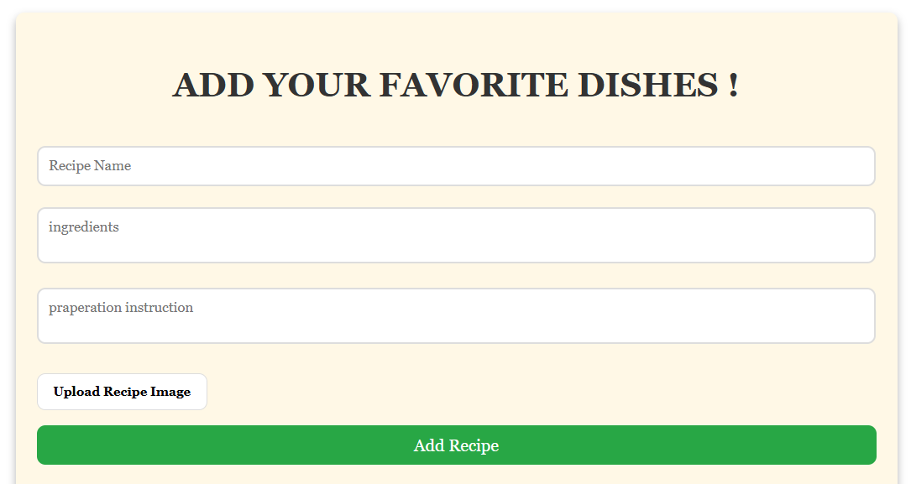
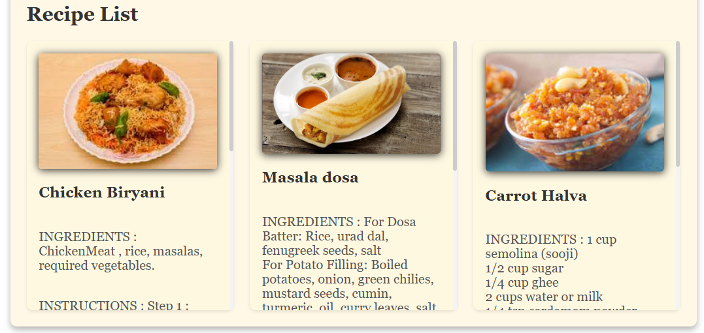
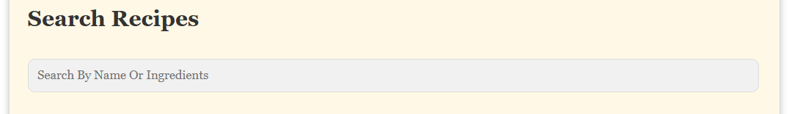
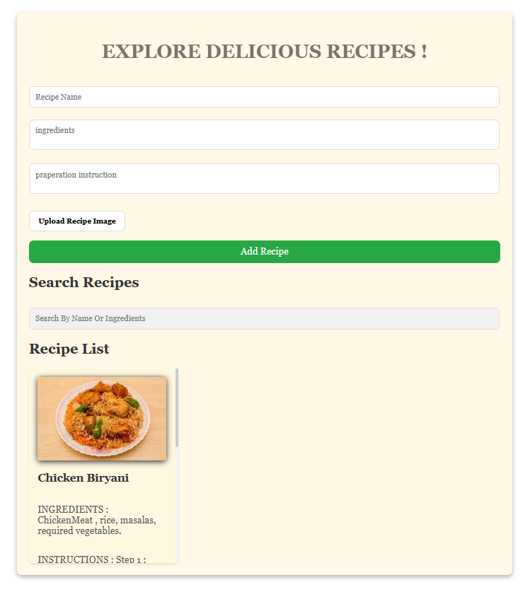

Live demo : [[ Start](https://kristoffer-7744.github.io/Recipe-Book/) ].
# Recipe Book

Welcome to the **Recipe Book** project! This is a web application where users can manage their favorite recipes. It allows users to add, view, search, and delete recipes with ease, including support for uploading images.

---

## Features
- **Add Recipes**: Users can add their favorite recipes with a name, ingredients, preparation instructions, and an optional image.
- **Search Recipes**: Quickly search recipes by name or ingredients.
- **Responsive Design**: Works seamlessly across different screen sizes.
- **Interactive UI**: Smooth animations and user-friendly interactions.
- **Delete Recipes**: Delete recipes with a confirmation dialog.
- **Persistent Storage**: Recipes are stored in the browser's local storage, so they remain available even after refreshing the page.

---

## Technologies Used
- **HTML**: Structure and layout of the web app.
- **CSS**: Styling for a visually appealing and responsive design.
- **JavaScript**: Adds interactivity and functionality.
  - DOM Manipulation
  - Event Handling
  - Local Storage API

---

## How to Use
### 1. Clone or Download the Repository
```bash
git clone <repository-url>
```

### 2. Open the Project
1. Open the `index.html` file in any modern web browser.
2. Ensure the `style.css` and `script.js` files are in the same directory as `index.html`.

### 3. Add Recipes
- Enter the recipe name, ingredients, and preparation instructions.
- Optionally, upload an image for the recipe.
- Click **Add Recipe**.

### 4. Search Recipes
- Use the search bar to filter recipes by name or ingredients.

### 5. Delete Recipes
- Click the **Delete** button on any recipe card to remove it. A confirmation dialog will appear before deletion.

---

## File Structure
```
├── index.html       # HTML structure of the web-application
├── style.css        # Styling for the web-application
├── script.js        # JavaScript for interactivity and functionality
├── yummy.jpg        # Default image for recipes (optional)
```

---

## Screenshots
### Add Recipes


### Recipe List


### Search Recipes


### Full Screen


---

## Future Enhancements
- Allow users to edit recipes.
- Add categories for recipes.
- Enable cloud storage for recipe persistence.

---

## License
This project is open-source and available under the [MIT License](LICENSE).

---

## Contributing
Contributions are welcome! Feel free to fork the repository and submit a pull request.

---

## Contact
For any questions or suggestions, please contact [krishnairmalwar7744@gmail.com].
